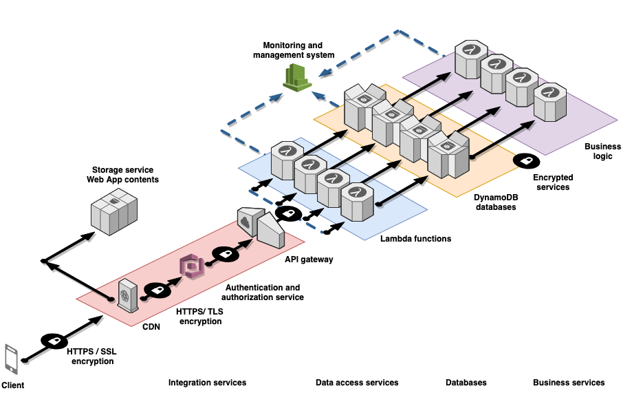

# Betterspace Documentation
This is the full documentation of the BetterSpace platform. This document is written for developers, data scientists and any stakeholders that want to understand the development principles behind the BetterSpace platform.

## Table of contents

1. [Intro and mission](#intro-and-mission) 
    1. [What is BetterSpace](#what-is-betterspace) 
    1. [User journey](#user-journey) 
1. [Best Practices](#best-practices) 
    <!-- 1. [Code](#code)
    1. [Data](#data)
    1. [Endpoints](#dendpoints)
    1. [Components](#components)
    1. [Designs](#designs)
    1. [Monitoring](#monitoring)
    1. [Logs](#logs)
    1. [Tests](#tests)
    1. [Deployment](#deployment)
    1. [Policies and Security](#policies-and-security)
    1. [Costs](#costs)
    1. [Risks](#risks)
    1. [Backlog](#backlog) -->
1. [Learning](#learning) 
1. [Front end overview](#front-end) 
1. [Back end overview](#back-end) 
1. [Endpoints overview](#api) 
1. [Data overview](#data) 
1. [Workloads](#workloads) 
    1. [Login/Signup](#login-signup) 
    1. [Assessment](#assessment) 
    1. [Ratings](#ratings) 
    1. [Transactions](#transactions) 
    1. [Directory](#directory) 
    1. [Profile](#profile) 
    1. [PostSales](#postSales) 
    1. [Budget](#budget) 
    1. [Monitoring](#monitoring) 
    1. [Notifications](#notifications) 
    1. [Dashboard](#dashboard) 


## Intro and mission

Approximately 1 in 4 people in the UK will experience a mental health problem each year. BetterSpace is building a wellbeing recommendation algorithm to help people find what is most likely to help their mental health. It’s a big project, and we’re developing the key areas of the functionality through a series of pilots with several companies over the next 6 months. The pilot will test the basic functionality, from data capture to the resources we include, and inform our future technical development and customer experience. 

### What is BetterSpace

BetterSpace is a workplace mental health service developed as a web based platform. The backend is hosted on a serverless architecture in AWS. The front end is a ReactJS single page webapp.

### User Journey
This section describes very briefly the journey that brings a company and its employees to start using our platform. Developers should derive from here the relationship among all the stakeholders, and what drives them using and promoting BetterSpace.

#### Step 1: The sale
Employers that express interest in BetterSpace usually fall in one of these two categories:
- extremely progressive employers that have always sought the best solutions for their employees, or
- extremely bad employers that have never cared about company culture and are now paying the debt on GlassDoor

In both cases they are looking for the best solution to their employees' wellbeing. 
Something that brings: 
- improved employee wellbeing
- high morale for internal culture
- something great to tell new recruits

Once the employers agree to purchase the BetterSpace service, they will take part in a 100 day sprint.
The employer will provide the following:
1. Number of participants and a list of emails that can sign up to the platform
1. Budget amount per participant
1. A list of resources they want to add or remove from the directory
1. The date for the kick off

#### Step 2: Kickoff
A kickoff meeting takes place at the employer's office. Our team introduce the mission and the platform in front of all the employees.
The goal of this meeting is to maximize impact and engagement with the pilot.  
Once the presentation finishes, we will send an email to all the participants with instructions on how to sign up and log in. We provide the custom url usually in the format  
`company_name.betterspace.uk`.

#### Step 3: Sign up
Participants sign up, receive a confirmation email and then they log in. Once logged in, they have to go through a wellbeing assessment.
This step functions as a way to:
- provide a piece of literature around mental health and the six pillars of wellbeing
- allow 10 minutes of self-reflection about their own health
- collect data on the users for the recommendation algorithm
- collect data for review of the directory creation


#### Step 4: Pilot
Participants will be able to spend their personal budget, provided by their employer, on any resource we will list on the directory.
Our main goals are:
1. Improve their wellbeing
1. Leave them excited by the product
1. Leave them relying on the platform as a source of trustful resources, updated weekly
1. Let them introspect via the platform
1. Increase discussion and sharing while smashing the stigma

The activities that they can undertake on the platform include:
- Reading their wellbeing scores, compare their strongest pillars and where they may need improvement
- Accessing a set of recommendations
- Browse, discover and buy resources
- Browse and rate completed resources
- Track their wellbeing

### Step 5: Results
After completing their resources, their wellbeing scores should see an improvement. Most of their budget is usually used. We want them to have enjoyed the service and be willing to spend their own money on the platform. Therefore, we want them to:
- keep discovering new resources
- start spending their own money
- use BetterSpace as their first point of direction towards better health

**[🔝 back to top](#table-of-contents)**


## Best Practices
This documentation is written for developers, data scientists and any stakeholder, wanting to understand in detail how the platform works.
- Tasks will be agreed all together at the beginning of the coding week, the product owner (Alfredo) will decide which tasks have priority and define a list of subtasks
- Developers, please (!), also create subtasks with completion time to track progress. Ideally each subtask falls into a 2, 4 or maximum 8 hours length.
- A demo will occur at the end of the week on Fridays to sync into the progress and decide the new steps.


#### Code
- Write your code with love and passion, someone (Alfredo ?), will read it.
- Only PR features in a working state, rebase and test before commit. Don’t break others people builds.
- Code is expected to be committed with proper title and description. Please follow the format already on the repository with  
`[SECTION] Title (issue number if any) Sensible description of changes`  
- Developers are expected to rebase their changes at least twice per week to avoid spending too much time resolving merge conflicts.
- The maintainer (Alfredo) will validate the feature and let the code merge into the master branch after being agreed.
- Code is linted


#### Data
- Data is described as a JSON and shared in a file in the BE repo /*workloadName/data.jon*
- Data is labelled as mutable / unmutabe
- Data is backed up
- Data is stored in the correct component
- Data is postprocessed in case it needs to be reused
- Data is consistent (success and error messages)

#### Endpoints
- Endpoints are described as a JSON and shared in a file in the FE repo 
- Endpoints are consistent (GET, POST, REMOVE, UPDATE)
- Endpoints are tested
- Endpoints have policies and are secure


#### Components FE
- Components are tested
- Components have wireframes
- Components have defaultProps
- Components are stateless as much as possible
- Components are graphically perfect
- Components handle data states (waiting for data, sending data, success and error)

#### Components BE
A component is the code configuration and AWS Resources that together deliver against a requirement.
- Components are chosen by following the 5 pillars of the AWS Well-Architected whitepaper
- Components are tested
- Components come whenever possible with a CloudFormation template

#### Monitoring
- Every workload comes with a monitoring facility
- Every workload comes with clear KPIs to allow monitoring
- Monitoring is easy to acess and to be analised

#### Logs
- Logs are stored and backed up
- Wherever needed logs have to be auditable

#### Tests
- Tests follow the BDD
- Unit test are performed for each main function
- Integration tests are performed for every service

#### Deployment
- Deployment is split into development and production stages
- Deployment is automated
- Deployment happens if all the tests pass
- Deployment is triggered by a change in the branch `live`

#### Policies and security
- Minimal access
- Tested
- Consitent

#### Costs
- Low cost
- Predictable and predicted
- Triggers alarms if the cost is higher than expected

#### Risks
- Every risk comes with severity (1 to 5)
- Every risk comes with a mitigation plan

#### Backlog
- the backlog is always split between bugs, improvement and new feature


**[🔝 back to top](#table-of-contents)**


## Learning
This section is aimed at listing some useful resources we have used to create this platform.   
  
  ***These reads are higly recommended.***  

Please feel free to ask Alfredo about any of these.
- `Agile`: [Lean Startup](/learn/TheLeanStartUp.epub), [Agile Project Management](/learn/AgileProjectManagementForDummies.epub)
- `Human Centered Design`: [Double Diamond](https://www.designcouncil.org.uk/news-opinion/design-process-what-double-diamond),
- `Coding`: [Javascript](https://github.com/getify/You-Dont-Know-JS), [Clean Code](/learn/CleanCode.pdf),
- `Front-end`: [HTML/CSS](https://developer.mozilla.org/en-US/docs/Learn), [HTML/CSS](https://internetingishard.com/html-and-css/), [CSS tricks](https://css-tricks.com/almanac/), [React](/learn/Learning_React-EN.pdf), [React-Router](https://reacttraining.com/react-router/web/guides/quick-start), [React-Redux](https://react-redux.js.org/introduction/quick-start), [Cypress](https://docs.cypress.io/guides/core-concepts/introduction-to-cypress.html#Cypress-Is-Simple), [JEST](https://jestjs.io/docs/en/getting-started.html)
- `Back-end`: [AWS Architecture](https://d1.awsstatic.com/whitepapers/architecture/AWS_Well-Architected_Framework.pdf), [Designing Data Intensive Applications](/learn/DesigningData-IntensiveApplications.pdf), [Micro Services](https://martinfowler.com/articles/microservices.html),


**[🔝 back to top](#table-of-contents)**

## Front end
The webapp front end is at the moment the signle place used by the participants and by the admin to access the platform. It has been developed desktop-first as a few companies allowed the participants to access the platform only by the desktop.  
A thourough documentation of the front end can be found in the front end repository at: https://github.com/Belfio/betterspace_testing  

We have used **ReactJS 16.8.6** to develop the whole structure of the website and **ES6** as the JavaScript standard.

### Libraries
The webapp takes advantage of a few important libraries:
- **React router 4.3.1**: it helps handling and moving through the different pages of the platform
- **Redux 6.0.0**: it helps managing storing and changing the platform data
- **Code splitter 1.2.1**: it splits the main javascript bundle  into different pieces so the brwoser loads one small package at the time
- **AWS SDK 2.382.0**: it allows the front end to communicate with the back end

### Folder organization and main architecture
The `src` folder contains the following main folders:
- `containers`: this folder contains one file per page. Each file represents one page and it contains all the business logic that gets passed to each single components. To each file it usually corresponds a folder inside the `components` folder, containing all the (usually stateless) components.
- `components`: this folder contains all the UI components and their styles. Inside, the folder `common`, contains the main library that should be used throughout the whole webapp.
- `assets`: is a folder that contains all the other files like - images, svgs, constants
- `actions`, `reducers` and `store` are three folders that contains all the relevant files to make **Redux** work.

### How to start
Any developer can play with the code by following the steps:
1. Open the terminal, fork the front end repo https://github.com/Belfio/betterspace_testing and enter into the folder
1. Run the command `yarn install` to install all the packages
1. Run the command `yarn start` to start the server and get the local version running
1. Now you can create a new jsx file inside `/src/`. This file will contain your new component.
1. In order to include this component to the whole project, please create the global `const`:  
    ```
    const NewComponent = props => <Async load={import('./NewComponent.jsx')} componentProps={props}/>
    ```
1. Finally, add it to the `render()` in your desired position (check Router `Switch` functionality and the`isAuthenticated()` function) as:  
    ```
    <Route exact path="/NewComponentPath" component={NewComponent} />
    ```  
    note the use of `exact` and `path`
1. Create a button link somewhere in the project if you selected a new specific `path`

**[🔝 back to top](#table-of-contents)**


## Back end 
The back end infrastructure is fully hosted on AWS. Here is a visual representation of all the used services.



In chronological order, the client communicates with the back end using the following services:  

- `Cloudfront`: it handles the dns requests, the SSL certificates and the different urls for the different companies
- `S3`: it hosts the full website platform and it is accessible by everyone
- `Cognito`: it manages the user authentication
- `API Gateway`: it is the key point of contact for authenticated users, here the API nodes trigger the micro services that will store, get, modify or remove data from the database.
- `DynamoDB`: NoSQL database, it stores the data in a format similar to JSON. API Gateway access the DynamoDB always via a Lambda function.
- `Lambda Functions`: they are the key component of the micro services. They are triggered by many services in the infrastructure and can trigger additional services, modify and store data in the databases. API Gateway is always connected to DynamoDB via Lambda functions.
- `CodePipeline`: this service helps the deployment of new code in differente stages (development and production ) by creating deployment steps. Once a new piece of code for the front end or for the back end is ready, it gets pushed to the GitHub repo. CodePipeline will pick the repo update and will deploy automatically the new code into a testing environment (currently hosted on team.betterspace.uk). The developers will be able to live test the new codebase and in case the code has no bugs and fullfills the requirements, CodePipeline will allow to push the code to the production stage where, and deployed to all the clients urls.
- `IAM`: this service is used to create policies (access and restrictions to access data and services) that gets applied to all the different type of users and to each service.  
- `AWS Organisations`:  the infrastructure is organised under this service that manages and monitors 3 physically separable accounts: a development account, a quality assurance (QA) account, and a production account. These three accounts are controlled by an admin account that performs business related tasks such as consolidated billing to monitor the spending of the three different accounts under the organisation and applies admin or super user restrictions and policies to the users in the organisation.

The infrastructure uses 2 external services for payment and billing, `Stripe` and `Xero`.

A new developer comes under ‘developers’ group in the development account and is given restricted access to services . These restrictions are applied either by an admin in the development account and/or by an admin in the organisation.

**[🔝 back to top](#table-of-contents)**


## Data
The platform collects users data and stores it in `DynamoDB`.  
It contains the following tables:  


- `wellbeing assessment`: user wellbeing assessments
- `wellbeing assessment update`: bi-monthly wellbeing assessment updates
- `ratings`: transaction ratings
- `profile`: user profiles
- `analytics`: all the clicks of the user in the platform
- `dashboard`: is a dynamic table that gets updated by lambda functions
- `recommendationsDB`: the directory
- `transactions`: user's transactions


## API
The back end infrastructure talks to the front end via RESTful API (GET and POST requestes).  
Every request needs an authentication session token that will be used by the back end to grant access to the user or admin only nodes.

The list of nodes available and it's functions are:


```javascript
    ASSESSMENT = {
        POST: (JSON) users and admin can post a full wellbeing assessment,
        GET: (array[JSON]) users and admin can get their own wellbeing assessments,
        GET_ADMIN_ALL: (array[JSON]) admin can get all the wellbeing assessments,
    },

    ASSESSMENT_UPDAT = {
        POST: (JSON) users and admin can post a wellbeing update,
        GET: (array[JSON]) users and admin can get their own wellbeing update,
        GET_ADMIN_ALL: (array[JSON]) admin can get all the wellbeing updates,
    }

    PROFILE = {
        POST: (JSON) users and admin can post their profile,
        GET: (JSON) users and admin can get their own profile,
        UPDATE: (JSON) users and admin can update their profile,
        GET_ADMIN_ALL: (array[JSON]) admin can get all the profiles,
        GET_ADMIN: (JSON) admin can get a specific profile specifying the `user_id`,
        POST_ADMIN: (JSON) admin can post/update a specific profile specifying the `user_id`,
    }

    TRANSACTION = {
        POST: (JSON) users and admin can post a new transaction,
        GET: (arrasy[JSON]) users and admin can get all their transactions,
        UPDATE: (JSON) users and admin can update a specific transaction -- DOUBLE CHECK WHAT ARE THE OPEN FIELDS,
        GET_ADMIN_ALL: (array[JSON]) admin can get all the transactions and can specify the `pilotTag`,
        GET_ADMIN: (array[JSON]) admin can get all the transactions of a specific users specifying the 'user_id',
        POST_ADMIN: (JSON) admin can post/update a transaction specifying the `user_id`,
        CANCEL: users and admin can cancel a transaction,
    }

    ACTIVITIES = {
        GET: (array[JSON]) users and admin can get all the activities and specify the pilotTag,
    }

    ACTIVITY = {
        POST: (JSON) admin can post a new activity,
        UPDATE: (JSON) admin can update an activity,
        GET: (JSON) users and admin can get a specific activity,
        DELETE: (JSON) admin can delete an activity,,
    }

    LIKE =  {
        POST: (JSON) admin can post a like,
        GET: (JSON) admin can get all the likes,
        DELETE: (JSON) admin can delete all the likes,
    }

    RATING = {
        POST:  (JSON) admin and users can post a rating,
        POSTPONE:  (JSON) admin and users can postpone a rating,
        ADMIN_GET_ALL: (array[JSON]) admin can get all the ratings,
        GET: (array[JSON]) admin and users can get their own ratings,
    }

    ANALYTICS = {
        POST: (JSON) admin and users can post an analytic,
        ADMIN_GET_ALL: (array[JSON]) admin can get all the analytics,
    }

    HOME = {
        GET: (JSON) admin and users can get an home data,
    }

    BUDGET = {
        POST: (JSON) admin and users need to post the amount of budget to add,
        REFUND: (JSON) admin and users need to post the amount of budget to withdraw,
    }

```

**[🔝 back to top](#table-of-contents)**


## Workloads
We use the term workload to identify a set of components that together deliver business value. The workload is usually the level of detail that business and technology leaders communicate about.
